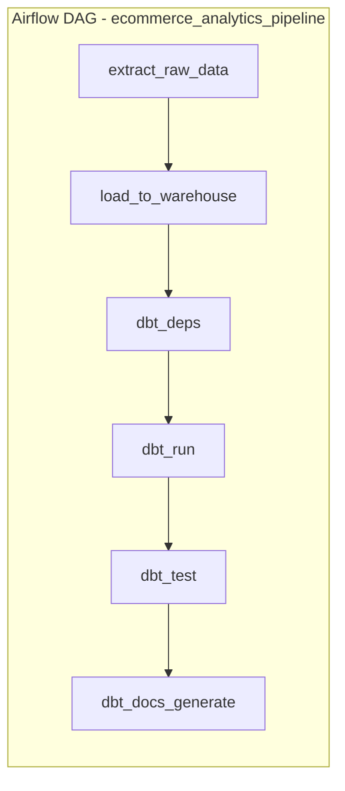

# E-commerce Analytics Pipeline — Airflow + dbt

An end-to-end batch analytics pipeline that **orchestrates** a daily extract/load
job with **Airflow** and **transforms** the data into a Kimball star schema with
**dbt**, gated by automated data-quality tests. Built to demonstrate hands-on
orchestration + modeling skills that don't show up in a SQL-only portfolio piece.

## Why this project exists

Most of my day-to-day work has been in SQL/Python/Spark, including building and
maintaining a production reporting pipeline (Python + Spark + Airflow, with
upstream data checks, automated retries, and failure alerts). This project
reproduces that same pattern end-to-end, from scratch, in a repo a reviewer can
clone and run in a few minutes.

## Architecture



| Layer | Tool | What it does |
|---|---|---|
| Orchestration | **Airflow** | Schedules the daily DAG, retries failed tasks (2x, 5 min backoff), fires an alert callback on failure, and hard-gates the pipeline so bad data never reaches `dbt_docs_generate` if `dbt_test` fails. |
| Extract / Load | Python + DuckDB | Simulates a vendor data drop (`generate_mock_data.py`) and loads it into a `raw` schema (`load_raw_to_duckdb.py`). DuckDB is used so the whole thing runs with zero external infra. |
| Transform | **dbt** | `staging` models clean/type raw data and quarantine bad records (e.g. null customer IDs). `marts` models build a Kimball star schema: `dim_customers`, `dim_products`, `fct_orders`. |
| Data quality | dbt tests | `unique`/`not_null`/`accepted_values`/`relationships` tests on every key model, plus a custom singular test (`assert_no_future_orders.sql`) and a `dbt_utils.accepted_range` check on revenue. |
| CI | GitHub Actions | On every push: validates the DAG has no import errors, then runs `dbt run` + `dbt test` against freshly generated mock data. |

## Data model (star schema)

```
dim_customers ──┐
                ├── fct_orders (grain: 1 row per order line)
dim_products ───┘
```

- **`fct_orders`**: order-line grain, joined to `dim_products` for category/price,
  with `gross_revenue` and `net_revenue` (excludes cancelled/refunded orders).
- Intentional data-quality issue injected into the mock feed (a handful of
  orders with a missing `customer_id`) so the staging model's filtering logic
  and dbt's `not_null` test have something real to catch — this isn't a toy
  "clean data in, clean data out" demo.

## Run it locally

### Option A — dbt only (fastest way to see the models/tests run)

```bash
pip install -r requirements.txt
python scripts/generate_mock_data.py
python scripts/load_raw_to_duckdb.py
cd dbt_project
dbt deps
dbt run --target ci
dbt test --target ci
dbt docs generate --target ci && dbt docs serve --target ci
```

### Option B — full pipeline via Airflow (Docker)

```bash
docker compose up
# open http://localhost:8080 — the standalone admin password is printed in
# the container logs on first boot. Unpause and trigger `ecommerce_analytics_pipeline`.
```

## Semantic layer (dbt Semantic Layer / MetricFlow)

Revenue, order counts, and AOV are defined **once**, semantically, in
`dbt_project/models/marts/_semantic_models.yml` and `_metrics.yml` — on top
of `fct_orders` — instead of every analyst (or every ad-hoc query) re-deriving
`sum(case when status = 'completed' ...)` from scratch. Metrics defined:
`total_net_revenue`, `total_gross_revenue`, `total_orders`, `total_units_sold`,
`average_order_value`.

Query them locally with the MetricFlow CLI:

```bash
pip install "dbt-metricflow[duckdb]"
cd dbt_project
mf query --metrics total_net_revenue,total_orders --group-by metric_time__day --profiles-dir .
```

CI validates these YAML files parse correctly on every push (`dbt parse`,
in the workflow below) — that catches most syntax errors, though it doesn't
execute an `mf query`, since MetricFlow's CLI setup is a bit heavier for a
CI box than it's worth for this project's size.

## Text-to-SQL evaluation (`scripts/text_to_sql_eval.py`)

Every model and column in `models/marts/_marts.yml` has a written
description — those descriptions are the *only* schema context this script
gives Claude before asking it to translate 8 business questions
("What is the total net revenue?", "Which product category generated the
most net revenue?", etc.) into SQL. Each generated query is run against the
DuckDB warehouse and compared to a hand-written reference query; the script
reports an accuracy score and writes a full breakdown to
`text_to_sql_eval_results.md`.

```bash
pip install anthropic pandas pyyaml
export ANTHROPIC_API_KEY=sk-...
python scripts/text_to_sql_eval.py
```

This is intentionally **not** wired into CI — it costs real API credits on
every run, so it's meant to be run on demand, not on every push. It's really
a documentation smoke test as much as a text-to-SQL demo: if the model gets
a question wrong, the fix is usually to make a column description more
precise, not to change the prompt.


## What I'd extend next

- Swap the DuckDB warehouse for Snowflake (profile is already parameterized —
  just add a `snowflake` target to `profiles.yml`)
- Add a `dbt source freshness` check as its own Airflow task ahead of `dbt_run`
- Replace the single-container Airflow setup with the standard
  scheduler/webserver/triggerer topology for a closer-to-production demo
- Add a Slack webhook to `alert_on_failure` instead of the simulated print
- - Add derived/filtered metrics (e.g. `completed_order_rate`) to the semantic
  layer once the base `simple`/`ratio` metrics are stable
- Expand the text-to-SQL eval set and track accuracy over time as models change

## Repo structure

```
dags/                              Airflow DAG definition
dbt_project/
  models/staging/                  Cleaned, typed views over raw sources
  models/marts/                    Kimball star schema (dim_*, fct_*)
    _marts.yml                     Model/column descriptions + tests
    _semantic_models.yml           dbt Semantic Layer: entities/dimensions/measures
    _metrics.yml                   Metric definitions (total_net_revenue, AOV, etc.)
  tests/                           Custom singular test
scripts/
  generate_mock_data.py            Mock raw data generation
  load_raw_to_duckdb.py            Loads raw CSVs into the warehouse
  text_to_sql_eval.py               Claude text-to-SQL accuracy eval
.github/workflows/ci.yml           DAG validation + dbt run/test/parse on every push
docker-compose.yml                 One-command local Airflow environment
```
