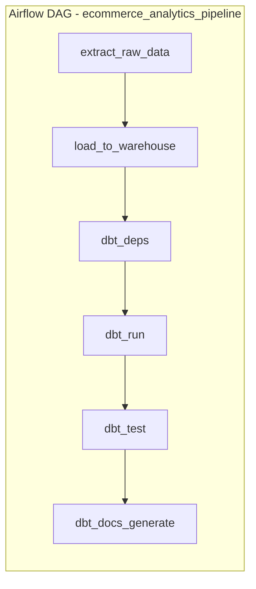

# E-commerce Analytics Pipeline — Airflow + dbt

An end-to-end batch analytics pipeline that **orchestrates** a daily extract/load
job with **Airflow** and **transforms** the data into a Kimball star schema with
**dbt**, gated by automated data-quality tests. Built to demonstrate hands-on
orchestration + modeling skills that don't show up in a SQL-only portfolio piece.

## Why this project exists

Most of my day-to-day work has been in SQL/Python/Spark, including building and
maintaining a production reporting pipeline (Python + Spark + Airflow, with
upstream data checks, automated retries, and failure alerts). This project
reproduces that same pattern end-to-end, from scratch, in a repo a reviewer can
clone and run in a few minutes.

## Architecture



| Layer | Tool | What it does |
|---|---|---|
| Orchestration | **Airflow** | Schedules the daily DAG, retries failed tasks (2x, 5 min backoff), fires an alert callback on failure, and hard-gates the pipeline so bad data never reaches `dbt_docs_generate` if `dbt_test` fails. |
| Extract / Load | Python + DuckDB | Simulates a vendor data drop (`generate_mock_data.py`) and loads it into a `raw` schema (`load_raw_to_duckdb.py`). DuckDB is used so the whole thing runs with zero external infra. |
| Transform | **dbt** | `staging` models clean/type raw data and quarantine bad records (e.g. null customer IDs). `marts` models build a Kimball star schema: `dim_customers`, `dim_products`, `fct_orders`. |
| Data quality | dbt tests | `unique`/`not_null`/`accepted_values`/`relationships` tests on every key model, plus a custom singular test (`assert_no_future_orders.sql`) and a `dbt_utils.accepted_range` check on revenue. |
| CI | GitHub Actions | On every push: validates the DAG has no import errors, then runs `dbt run` + `dbt test` against freshly generated mock data. |

## Data model (star schema)

```
dim_customers ──┐
                ├── fct_orders (grain: 1 row per order line)
dim_products ───┘
```

- **`fct_orders`**: order-line grain, joined to `dim_products` for category/price,
  with `gross_revenue` and `net_revenue` (excludes cancelled/refunded orders).
- Intentional data-quality issue injected into the mock feed (a handful of
  orders with a missing `customer_id`) so the staging model's filtering logic
  and dbt's `not_null` test have something real to catch — this isn't a toy
  "clean data in, clean data out" demo.

## Run it locally

### Option A — dbt only (fastest way to see the models/tests run)

```bash
pip install -r requirements.txt
python scripts/generate_mock_data.py
python scripts/load_raw_to_duckdb.py
cd dbt_project
dbt deps
dbt run --target ci
dbt test --target ci
dbt docs generate --target ci && dbt docs serve --target ci
```

### Option B — full pipeline via Airflow (Docker)

```bash
docker compose up
# open http://localhost:8080 — the standalone admin password is printed in
# the container logs on first boot. Unpause and trigger `ecommerce_analytics_pipeline`.
```

## What I'd extend next

- Swap the DuckDB warehouse for Snowflake (profile is already parameterized —
  just add a `snowflake` target to `profiles.yml`)
- Add a `dbt source freshness` check as its own Airflow task ahead of `dbt_run`
- Replace the single-container Airflow setup with the standard
  scheduler/webserver/triggerer topology for a closer-to-production demo
- Add a Slack webhook to `alert_on_failure` instead of the simulated print

## Repo structure

```
dags/                          Airflow DAG definition
dbt_project/
  models/staging/              Cleaned, typed views over raw sources
  models/marts/                Kimball star schema (dim_*, fct_*)
  tests/                       Custom singular test
scripts/                       Mock data generation + warehouse load
.github/workflows/ci.yml       DAG validation + dbt run/test on every push
docker-compose.yml             One-command local Airflow environment
```
